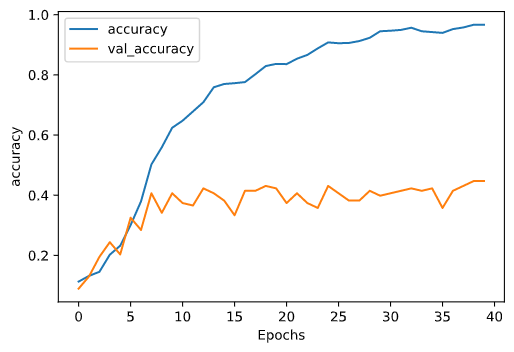
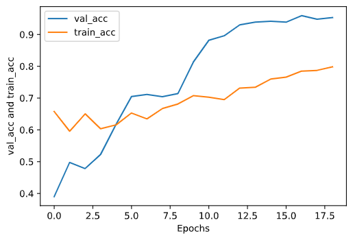

# Identification of Political Framing in Tweets of US politicians
The setting of my experiment involves a labelled dataset which contains tweets made by US politicians along with the true value of the frame they fall into. The frames are according to what is mentioned in [this](https://www.aclweb.org/anthology/P17-1069/) paper and the data is taken from [this](https://github.com/alexlitel/congresstweets) repository.

The baseline model essentially utilizes two Bi-LSTMs and some Dense layers. Given the serial nature of LSTMs, they are not a suitable candidate for retaining deep context. Hence, an extension of the model is suggested which would utilize unlabelled data for self-training. A detailed description of my entire experiment can be found [here](https://drive.google.com/file/d/1NNxzHTNC7TBhST95s_eVj2c9sfAzWUcn/view?usp=sharing)

To briefly compare the models before and after applying the extension, here are the results.

Although the images do show scope of improvement, my detailed description in the paper explains further improvements on the extension which addresses problems like class imbalance. As I am limited by the scope of this experiment, further improvements are mentioned in the last section of the paper.
